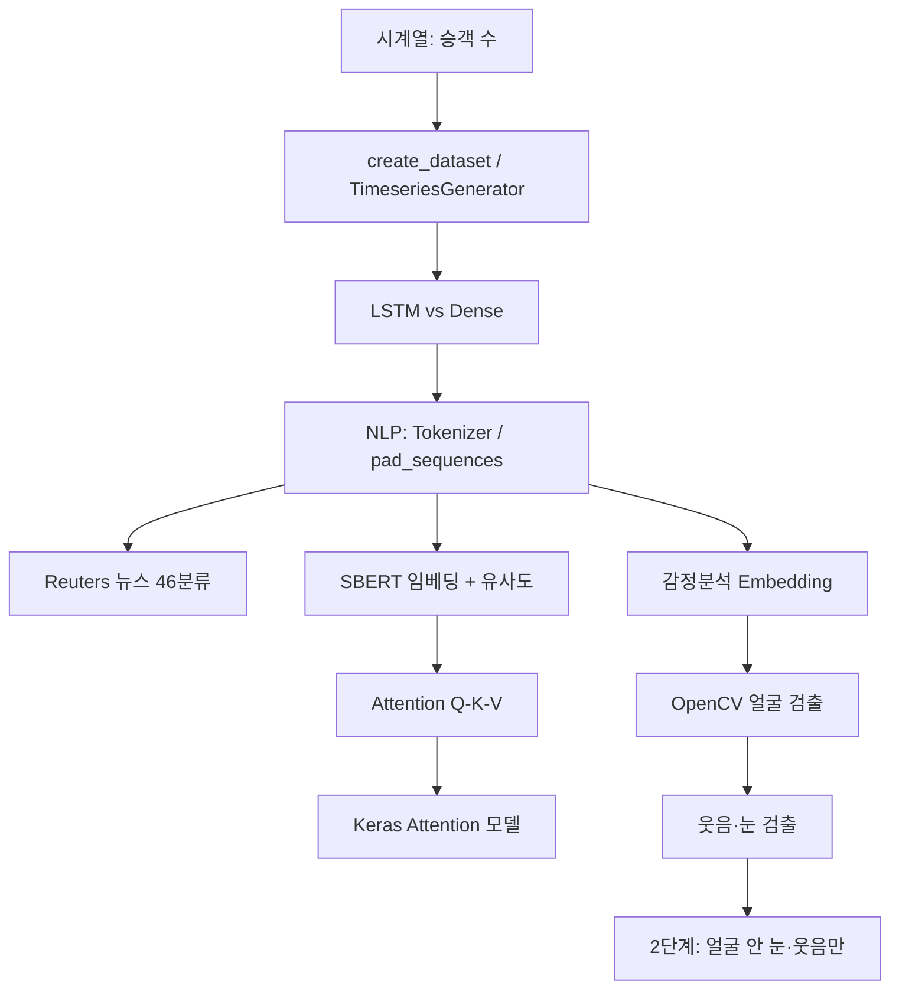

# Day 2 보충 — 시계열 · NLP · Attention · OpenCV 학습 노트

> Colab 실습 기준 | 오타 수정 반영 | 중복 제거 통합본

---

## 목차

1. [전체 뼈대 및 흐름도](#1-전체-뼈대-및-흐름도)
2. [공책 필기용 핵심 문장](#2-공책-필기용-핵심-문장)
3. [중요 개념 정리](#3-중요-개념-정리)
4. [실무 적용 지도](#4-실무-적용-지도)
5. [키보드 타이핑 코드 모음](#5-키보드-타이핑-코드-모음)
6. [자주 틀리는 오타 · 에러 해결](#6-자주-틀리는-오타--에러-해결)
7. [shape 치트시트](#7-shape-치트시트)

---

## 1. 전체 뼈대 및 흐름도

### 1-1. 딥러닝 공통 파이프라인

```
[데이터] → [숫자 변환] → [shape 맞추기] → [모델] → compile → fit → evaluate/predict
```

| 단계 | 시계열 | 텍스트 분류 | Attention |
|:---|:---|:---|:---|
| 데이터 | Passengers.csv | Reuters / 문장 리스트 | query + value |
| 변환 | create_dataset / Generator | one_hot / matrix / Embedding | Embedding + Conv1D |
| shape | (N, look_back) 또는 (N,1,look_back) | (N, 1000) 또는 (N, maxlen) | [query, value] |
| 출력 | MSE / RMSE | softmax 46클래스 / sigmoid 1 | sigmoid 1 |
| loss | mean_squared_error | categorical_crossentropy | binary_crossentropy |

### 1-2. 오늘 학습 로드맵



### 1-3. 모델별 입력 차원 (가장 중요)

| 모델 | 입력 shape | 예시 |
|:---|:---|:---|
| Dense | 2D `(배치, 특성)` | `(32, 384)`, `(8932, 1000)` |
| LSTM | 3D `(배치, 시점, 특성)` | `(32, 2, 1)`, `(32, 10, 8)` |
| Embedding + Flatten | 2D 정수 `(배치, 단어수)` | `(10, 5)` |
| Attention (2입력) | `[query, value]` 각 `(배치, seq)` | `[dummy_query, dummy_value]` |

---

## 2. 공책 필기용 핵심 문장

> 교실에서 그대로 옮겨 적기 좋은 문장만 모음

### 시계열
- `look_back` = 과거 몇 시점을 보고 다음을 예측하는지
- `create_dataset` = 슬라이딩 윈도우로 (입력X, 정답Y) 쌍 생성
- LSTM cell은 **1개**가 시점 수만큼 **반복** (cell 10개 ≠ 타임스텝 10개)
- `return_sequences=True` → 시점마다 출력 → Attention 입력용
- `return_state=True` → 마지막 h(단기), c(장기) 반환

### NLP
- Tokenizer = 단어장 만들기 + 단어→정수
- `pad_sequences` = 문장 길이 통일 (짧으면 0, 길면 자름)
- `sequences_to_matrix` = 시퀀스→고정길이 0/1 행렬 (순서 무시, Dense용)
- `to_categorical` = 정수 라벨→원-핫 (softmax와 짝)
- SBERT `encode` = 문장 전체→의미 벡터 (분류·유사도에 사용)

### Attention
- Query = "뭘 찾을까?"
- Key = "나는 어떤 색인/라벨?"
- Value = "실제로 전달할 내용"
- `attn_scores = querys @ keys.T` = "너 나한테 중요해?"
- softmax 후 Value 가중 합 = Attention 출력
- Transformer = Self-Attention + Position Encoding + Encoder/Decoder
- BERT = Encoder만 (분류·이해) / GPT = Decoder만 (생성)

### OpenCV
- OpenCV는 **BGR**, matplotlib은 **RGB** → `cvtColor(BGR2RGB)` 필수
- Haar Cascade = 미리 학습된 패턴으로 `(x,y,w,h)` 검출
- `detectMultiScale(grey, scaleFactor, minNeighbors)` — minNeighbors 클수록 엄격
- **2단계 검출**: 얼굴 먼저 → 눈·웃음이 얼굴 박스 **안에 포함**될 때만 그림
- 포함 조건: `x<=x_s`, `y<=y_s`, `x+w>=x_s+w_s`, `y+h>=y_s+h_s`

---

## 3. 중요 개념 정리

### 3-1. 시계열 예측

| 개념 | 설명 |
|:---|:---|
| train/test 분할 | 시계열은 **시간 순서 유지** (랜덤 섞기 X) |
| `create_dataset` | `dataX[i] = dataset[i:i+look_back]`, `dataY[i] = dataset[i+look_back]` |
| TimeseriesGenerator | `create_dataset`와 동일 목적, **배치 단위**로 공급 |
| MSE / RMSE | MSE 작을수록 좋음, RMSE=√MSE로 단위 해석 쉬움 |

### 3-2. 텍스트 전처리 비교

| 방법 | 결과 | 순서 유지 | 용도 |
|:---|:---|:---:|:---|
| `pad_sequences` | `(N, maxlen)` 정수 | O | LSTM/RNN |
| `sequences_to_matrix` | `(N, max_words)` 0/1 | X | Dense/MLP |
| SBERT `encode` | `(N, 384)` 실수 | 문장 단위 | 유사도·검색 |
| `one_hot` | 해시 기반 정수 | O | 간단 실습용 |

### 3-3. 분류 문제별 출력·loss

| 문제 | 출력층 | 활성화 | loss |
|:---|:---|:---|:---|
| 이진 (긍/부) | Dense(1) | sigmoid | binary_crossentropy |
| 다중 (46뉴스) | Dense(46) | softmax | categorical_crossentropy |
| 회귀 (승객 수) | Dense(1) | 없음/linear | mean_squared_error |

### 3-4. LSTM 내부 기억

| 상태 | 역할 | 비유 |
|:---|:---|:---|
| hidden (h) | 출력·단기 기억 | 지금까지 요약 |
| cell (c) | 장기 기억 | 오래 보관 |

### 3-5. Attention vs CNN vs RNN

| | 잡는 특징 | 순서 |
|:---|:---|:---|
| CNN / Conv1D | 지역(local) 패턴 | 공간/시퀀스 이웃 |
| RNN / LSTM | 시간 순서 | 시점 간 전달 |
| Attention | 토큰 간 관계 | 순서는 Position Encoding으로 보완 |

---

## 4. 실무 적용 지도

| 오늘 배운 것 | 실제 사용처 | 번역? |
|:---|:---|:---:|
| 시계열 LSTM | 매출·수요·주가 예측 | X |
| Tokenizer / pad_sequences | 거의 모든 NLP 전처리 | X |
| Reuters 분류 | 뉴스·문서 카테고리 자동 분류 | X |
| SBERT + cosine | FAQ 매칭, 의미 검색, 중복 탐지 | X |
| Query-Value Attention | 검색, QA, RAG(문서 찾기) | △ |
| Transformer 전체 | 번역, 요약, GPT | O |
| 감정 Embedding 모델 | 리뷰·댓글 긍/부정 | X |
| OpenCV Haar | 카메라 얼굴인식, 사진 앱 | X |
| OpenCV 2단계 | 얼굴→눈/웃음 (오검출 감소) | X |

**한 줄:** 번역 = Transformer/Attention 계열 | 긍/부·뉴스분류 = sigmoid/softmax 분류 | 검색 = SBERT/Attention

---

## 5. 키보드 타이핑 코드 모음

> Colab에서 직접 쳐 볼 핵심 블록 (오타 수정 완료)

### 5-1. 시계열 — create_dataset + LSTM

```python
import numpy as np
import math
from tensorflow.keras.models import Sequential
from tensorflow.keras.layers import Dense, LSTM

def create_dataset(dataset, look_back=1):
    dataX, dataY = [], []
    for i in range(len(dataset) - look_back - 1):
        a = dataset[i:(i + look_back), 0]
        dataX.append(a)
        dataY.append(dataset[i + look_back, 0])
    return np.array(dataX), np.array(dataY)

look_back = 2
trainX, trainY = create_dataset(train, look_back)

# LSTM은 3D 입력 필요
trainX = trainX.reshape(-1, look_back, 1)

model = Sequential([
    LSTM(8, input_shape=(look_back, 1), activation='tanh'),
    Dense(1)
])
model.compile(loss='mean_squared_error', optimizer='adam')
model.fit(trainX, trainY, epochs=200, batch_size=2, verbose=2)
```

### 5-2. TimeseriesGenerator

```python
from tensorflow.keras.preprocessing.sequence import TimeseriesGenerator

train_generator = TimeseriesGenerator(
    data=train, targets=train,
    length=look_back, batch_size=2
)
model.fit(train_generator, epochs=200, verbose=2)
```

### 5-3. Reuters 뉴스 분류 (numpy 배열 대응)

```python
from tensorflow.keras.datasets import reuters
from tensorflow.keras.utils import to_categorical
from tensorflow.keras.models import Sequential
from tensorflow.keras.layers import Dense, Dropout

max_words = 1000
(X_train, y_train), (X_test, y_test) = reuters.load_data(
    num_words=max_words, test_split=0.2
)
nb_classes = np.max(y_train) + 1  # 46

def vectorize_sequences(sequences, dimension):
    results = np.zeros((len(sequences), dimension), dtype='float32')
    for i, seq in enumerate(sequences):
        seq = np.asarray(seq).flatten()
        results[i, seq] = 1.
    return results

X_train = vectorize_sequences(X_train, max_words)
X_test = vectorize_sequences(X_test, max_words)
Y_train = to_categorical(y_train, nb_classes)
Y_test = to_categorical(y_test, nb_classes)

model = Sequential([
    Dense(512, input_shape=(max_words,), activation='relu'),
    Dropout(0.5),
    Dense(nb_classes, activation='softmax')
])
model.compile(loss='categorical_crossentropy', optimizer='adam', metrics=['accuracy'])
model.fit(X_train, Y_train, epochs=200, batch_size=100, validation_split=0.1, verbose=0)
```

### 5-4. SBERT 임베딩 + 유사도

```python
from sentence_transformers import SentenceTransformer
from sklearn.metrics.pairwise import cosine_similarity

sbert_model = SentenceTransformer('all-MiniLM-L6-v2')
sentences = ['나는 자연어 처리를 좋아해', '텍스트를 숫자로 변환해보자']
embeddings = sbert_model.encode(sentences)

query = sbert_model.encode(['기계학습 모델에 텍스트 데이터를 집어넣으려고 해요'])
scores = cosine_similarity(query, embeddings)[0]
```

### 5-5. Attention 수동 예제

```python
import tensorflow as tf

x = tf.convert_to_tensor([[1,0,1,0], [0,2,0,2], [1,1,1,1]], dtype=tf.float32)
w_key = tf.constant([[0,0,1],[1,1,0],[0,1,0],[1,1,0]], dtype=tf.float32)
w_query = tf.constant([[1,0,1],[1,0,0],[0,0,1],[0,1,1]], dtype=tf.float32)
w_value = tf.constant([[0,2,0],[0,3,0],[1,0,3],[1,1,0]], dtype=tf.float32)

keys = tf.matmul(x, w_key)
querys = tf.matmul(x, w_query)
values = tf.matmul(x, w_value)
attn_scores = tf.matmul(querys, keys, transpose_b=True)
attn_weights = tf.nn.softmax(attn_scores, axis=-1)
output = tf.matmul(attn_weights, values)
```

### 5-6. Keras Attention 분류 모델

```python
import tensorflow as tf
from tensorflow.keras import layers
from tensorflow.keras.models import Model

def build_attention_model():
    query_input = tf.keras.Input(shape=(None,), dtype='int32')
    value_input = tf.keras.Input(shape=(None,), dtype='int32')

    token_embedding = layers.Embedding(1000, 64)
    query_seq = layers.Conv1D(100, 4, padding='same')(token_embedding(query_input))
    value_seq = layers.Conv1D(100, 4, padding='same')(token_embedding(value_input))

    attn_seq = layers.Attention()([query_seq, value_seq])
    query_pool = layers.GlobalAveragePooling1D()(query_seq)
    attn_pool = layers.GlobalAveragePooling1D()(attn_seq)
    merged = layers.Concatenate()([query_pool, attn_pool])

    x = layers.Dense(64, activation='relu')(merged)
    x = layers.Dropout(0.3)(x)
    out = layers.Dense(1, activation='sigmoid', name='Probability')(x)
    return Model(inputs=[query_input, value_input], outputs=out, name='Attention_Network')

# fit 시 주의: [query, value] / labels
# model.fit([dummy_query, dummy_value], dummy_labels, epochs=3, batch_size=4)
```

### 5-7. 감정 분석 (Embedding)

```python
from tensorflow.keras.preprocessing.text import one_hot
from tensorflow.keras.preprocessing.sequence import pad_sequences
from tensorflow.keras.models import Sequential
from tensorflow.keras.layers import Embedding, Flatten, Dense

docs = ['Well done!', 'Good work', 'Great effort', 'Weak', 'Poor effort!']
labels = [1, 1, 1, 0, 0]
vocab_size = 10
maxlen = 5

padded = pad_sequences([one_hot(d, vocab_size) for d in docs], maxlen=maxlen, padding='post')

model = Sequential([
    Embedding(input_dim=vocab_size, output_dim=32),
    Flatten(),
    Dense(1, activation='sigmoid')
])
model.compile(optimizer='adam', loss='binary_crossentropy', metrics=['accuracy'])
model.fit(padded, np.array(labels), epochs=30, verbose=1)

def predict_sentiment(sentence):
    enc = one_hot(sentence, vocab_size)
    pad = pad_sequences([enc], maxlen=maxlen, padding='post')
    prob = model.predict(pad, verbose=0)[0][0]
    print(f'[{sentence}] → {prob:.4f} → {"긍정" if prob >= 0.5 else "부정"}')
```

### 5-8. OpenCV 얼굴 검출

```python
import cv2
import matplotlib.pyplot as plt

base_image = cv2.imread('family.jpg')
grey = cv2.cvtColor(base_image, cv2.COLOR_BGR2GRAY)

face_cascade = cv2.CascadeClassifier('haarcascade_frontalface_default.xml')
faces = face_cascade.detectMultiScale(grey, scaleFactor=1.3, minNeighbors=5)

for (x, y, w, h) in faces:
    cv2.rectangle(base_image, (x, y), (x+w, y+h), (255, 0, 0), 2)

plt.imshow(cv2.cvtColor(base_image, cv2.COLOR_BGR2RGB))
plt.show()
```

### 5-9. OpenCV 웃음·눈 + 2단계 검출 (얼굴 안만)

```python
import cv2
import matplotlib.pyplot as plt

base_image = cv2.imread('family.jpg')
grey = cv2.cvtColor(base_image, cv2.COLOR_BGR2GRAY)

# --- cascade 로드 ---
face_cascade = cv2.CascadeClassifier('haarcascade_frontalface_default.xml')
smile_cascade = cv2.CascadeClassifier('haarcascade_smile.xml')
eye_cascade = cv2.CascadeClassifier('haarcascade_eye.xml')

# --- 1차 검출 (흑백 이미지에서) ---
faces = face_cascade.detectMultiScale(grey, 1.3, 5)    # 얼굴: minNeighbors=5
smiles = smile_cascade.detectMultiScale(grey, 1.3, 20) # 웃음: 20 (엄격)
eyes = eye_cascade.detectMultiScale(grey, 1.3, 1)      # 눈: 1 (느슨)

# --- 2단계: 얼굴 안의 눈·웃음만 그리기 ---
test_image = cv2.imread('family.jpg')

for (x, y, w, h) in faces:
    cv2.rectangle(test_image, (x, y), (x+w, y+h), (255, 0, 0), 2)  # 파란=얼굴

    for (x_s, y_s, w_s, h_s) in eyes:
        if (x <= x_s) and (y <= y_s) and (x+w >= x_s+w_s) and (y+h >= y_s+h_s):
            cv2.rectangle(test_image, (x_s, y_s), (x_s+w_s, y_s+h_s), (255, 255, 255), 2)

    for (x_s, y_s, w_s, h_s) in smiles:
        if (x <= x_s) and (y <= y_s) and (x+w >= x_s+w_s) and (y+h >= y_s+h_s):
            cv2.rectangle(test_image, (x_s, y_s), (x_s+w_s, y_s+h_s), (0, 255, 0), 2)

plt.imshow(cv2.cvtColor(test_image, cv2.COLOR_BGR2RGB))
plt.show()
```

**detectMultiScale 파라미터 & 박스 색 (BGR):**

| 대상 | minNeighbors | 박스 색 (BGR) | 이유 |
|:---|:---:|:---|:---|
| 얼굴 | 5 | `(255, 0, 0)` 파란 | 기본 |
| 웃음 | 20 | `(0, 255, 0)` 초록 | 오검출 많아서 엄격 |
| 눈 | 1 | `(255, 255, 255)` 흰 | 작아서 느슨하게 |

**`(x, y, w, h)` 의미:**

| 변수 | 의미 |
|:---|:---|
| `(x, y)` | 사각형 **좌상단** |
| `(w, h)` | **너비, 높이** |
| `(x+w, y+h)` | **우하단** (`cv2.rectangle` 두 번째 점) |

**2단계 검출 흐름:**

```
grey → faces 검출
         ↓
for each 얼굴:
    파란 박스
    eyes/smiles 중 얼굴 박스 안에 완전 포함 → 흰/초록 박스
```

---

## 6. 자주 틀리는 오타 · 에러 해결

| 잘못 | 올바름 | 증상 |
|:---|:---|:---|
| `sentence-transfomers` | `sentence-transformers` | pip 설치 실패 |
| `nb_words` (미정의) | `num_words=max_words` | NameError |
| `Tokenizer(nb_words=...)` | `Tokenizer(num_words=...)` | TypeError |
| `fit([query, labels], ...)` | `fit([query, value], ...)` | softmax 경고 |
| LSTM에 `(N, 384)` | `reshape(-1, 1, 384)` | shape 에러 |
| `sequences_to_matrix` on numpy | `tolist()` 또는 `vectorize_sequences` | ambiguous truth value |
| `tensorflow==2.16.1` (Colab) | Colab 기본 TF + 코드 수정 | dependency conflicts |
| `vlaue`, `actiavtion`, `fina_carry` | value, activation, final_carry | NameError/오타 |
| `print(model.summary())` | `model.summary()` | None 출력 |
| OpenCV imshow 색 이상 | `cvtColor(BGR2RGB)` | 빨강/파랑 뒤바뀜 |

### Keras/Colab 환경 팁

```python
# Dense 입력 (2D)
model.add(Dense(8, input_shape=(look_back,)))

# LSTM 입력 (3D)
model.add(LSTM(8, input_shape=(look_back, 1)))

# pip 설치 후 반드시 런타임 재시작
```

---

## 7. shape 치트시트

```
시계열 Dense:     trainX (N, look_back)           예: (88, 2)
시계열 LSTM:      trainX (N, look_back, 1)        예: (88, 2, 1)
SBERT:            embeddings (N, 384)             예: (3, 384)
Reuters X:        (N, 1000)  이진
Reuters Y:        (N, 46)    원-핫
감정 padded:      (N, maxlen)  예: (10, 5)
Embedding 출력:   (N, maxlen, dim) → Flatten → (N, maxlen*dim)
LSTM 기본 출력:   (batch, units)                  예: (32, 4)
LSTM return_seq:  (batch, timesteps, units)         예: (32, 10, 4)
Attention fit:    x=[query(B,sq_q), value(B,sq_v)], y=(B,1)
OpenCV 이미지:    (H, W, 3) BGR
```

---

## 복습 체크리스트

- [ ] `look_back` 의미와 `create_dataset` 로직 설명 가능
- [ ] Dense 2D vs LSTM 3D 차이 설명 가능
- [ ] `pad_sequences` vs `sequences_to_matrix` 차이
- [ ] `nb_classes = np.max(y_train) + 1` 의미
- [ ] Attention Q/K/V 역할 한 줄씩
- [ ] `fit([query, value], labels)` 입력 순서
- [ ] sigmoid+binary vs softmax+categorical 구분
- [ ] 감정분석 vs 번역 용도 구분
- [ ] OpenCV BGR→RGB 이유
- [ ] `(x,y,w,h)` 좌상단·우하단 의미
- [ ] minNeighbors 크기에 따른 검출 엄격도
- [ ] 2단계 검출 if문 (얼굴 안 포함 조건) 4줄

---

*마지막 업데이트: 2026-07-08 (OpenCV 2단계 검출 추가)*
